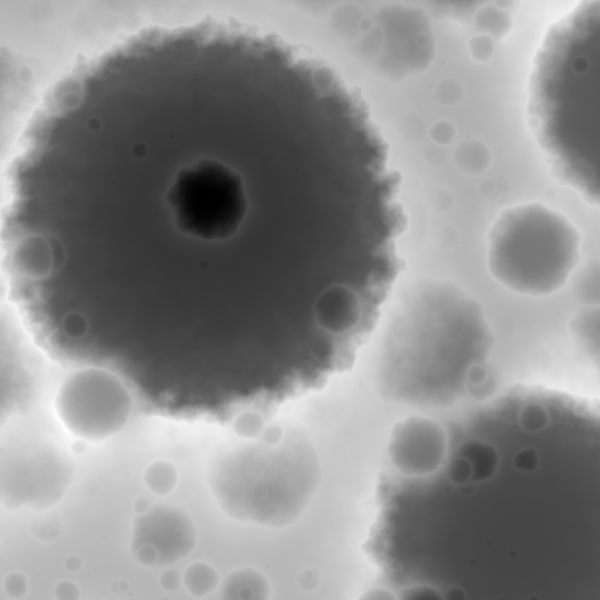
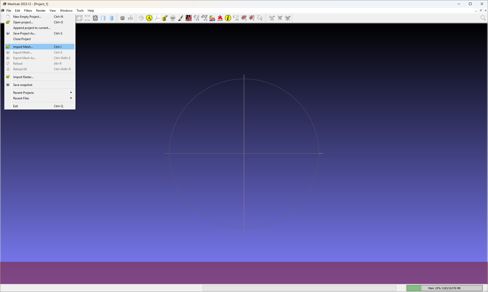
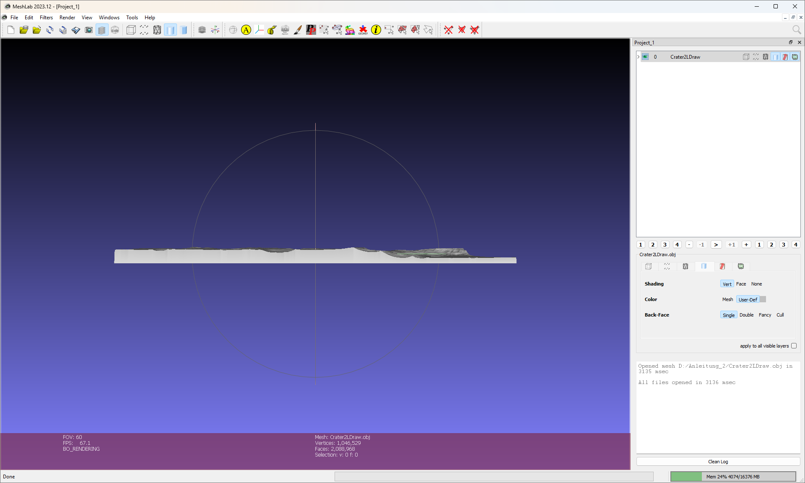
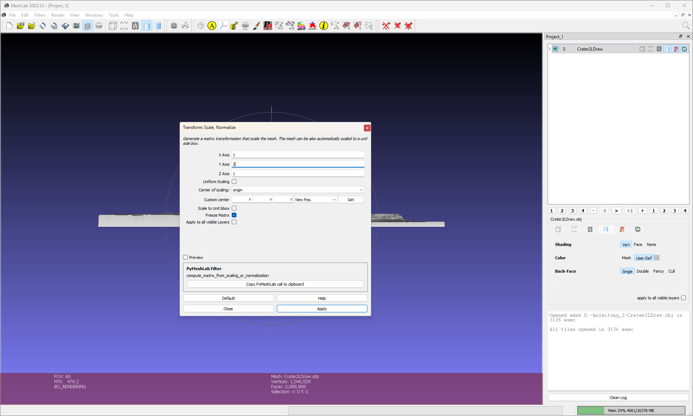
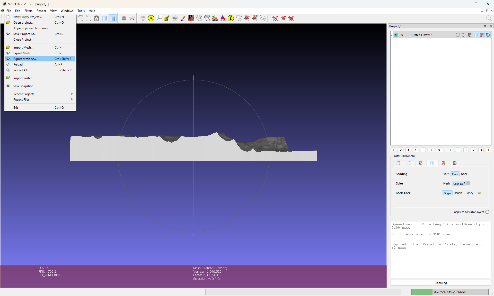
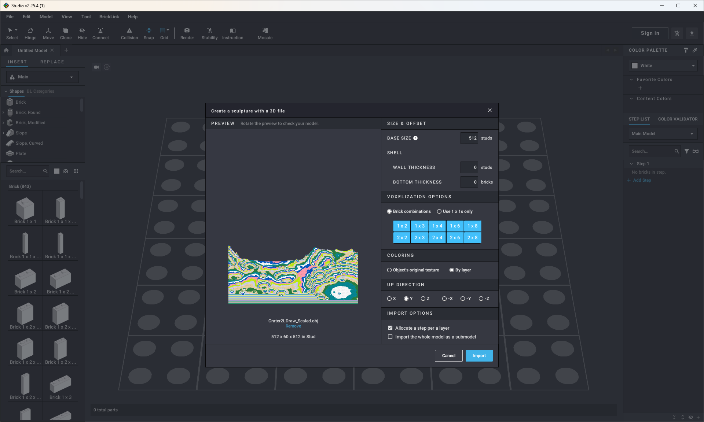
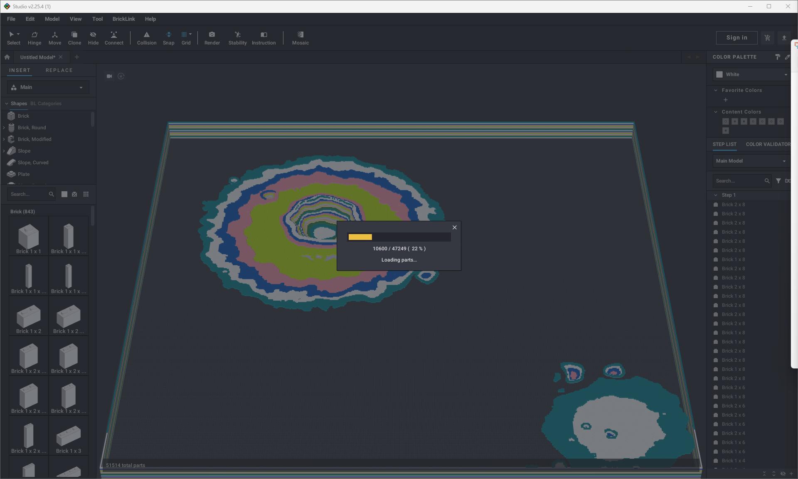
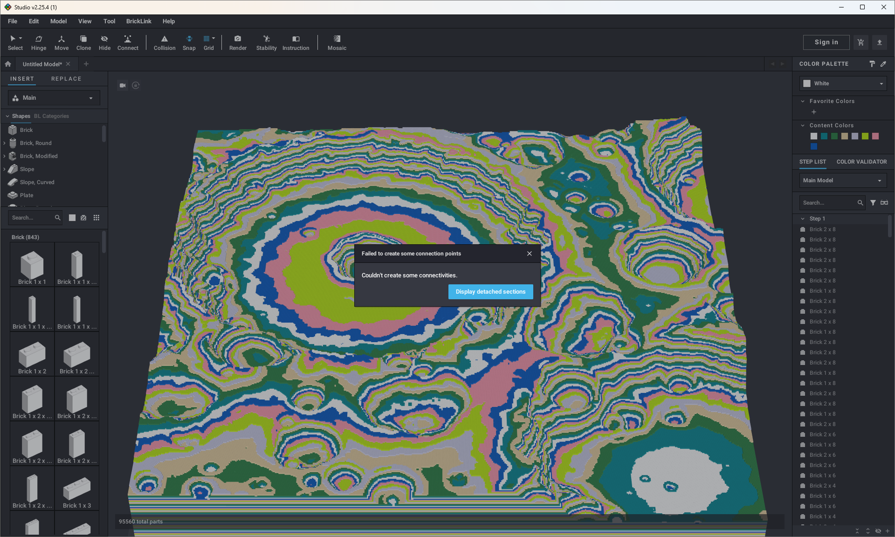
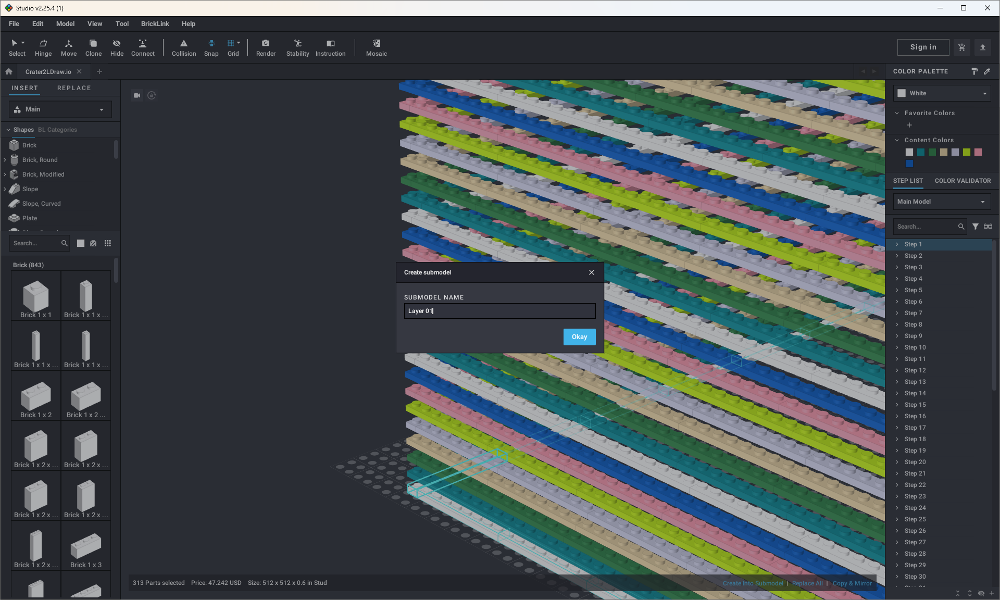
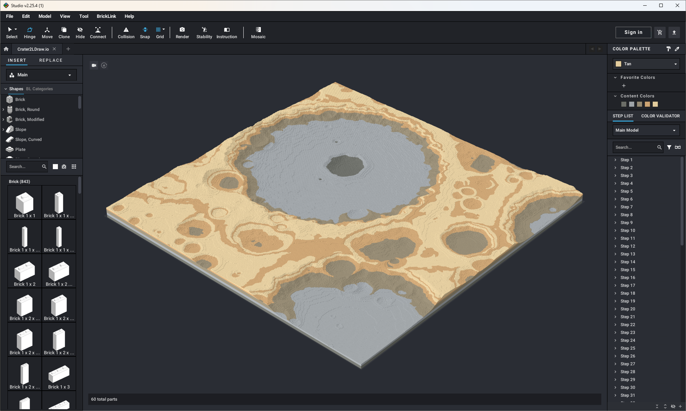

# Crater2LDraw (using Quadspinner Gaea, MeshLab and Bricklink Studio)

## Disclaimer

The following instructions are intended to serve as an idea on how to create a crater landscape compatible with LDraw. 
There are several ways to generate landscapes or cliffs. For example, the following JavaScripts:
- https://gitlab.com/sylvainls/ldraw_landscape.html
- https://gitlab.com/sylvainls/ldraw_cliff.html

Unfortunately, these variants do not work directly for crater landscapes. This prompted the idea of ​​using Gaea to export the generated landscape into an LDraw-compatible format somehow. The procedure described below should be possible for any landscape generated with Gaea, not just for crater landscapes. However, since Bricklink Studio uses bricks instead of plates, an intermediate step with MeshLab is necessary to first scale the landscape generated in Gaea along the z-axis. The basic idea, however, remains the same. Alternatively you can stop after step 4 and use the generated heightfield *.png (grayscale) file together with https://gitlab.com/sylvainls/ldraw_landscape.html. This is probably easier, but also less accurate. Do whatever you think is the better way in your case.

The instructions assume that you already have some familiarity with Bricklink Studio. Accordingly, not every step is explained in detail.

## Software
- [Quadspinner Gaea](https://quadspinner.com) 2.1.2.0 Community Edition
- [MeshLab](https://www.meshlab.net) 2023.12
- [Bricklink Studio](https://www.bricklink.com)  2.25.4.1
- Microsoft PowerShell

## Instructions

### Step 1
Create a new crater field within Gaea. Play with the values as you wish.  
- **Comment**: Activate the drop option to place the generated terrain as low as possible.
- **Comment**: Optionally you can use the *.terrain file I used for this instructions. You find it [here](files/Crater2LDraw.terrain).

### Step 2
Add a Mesher to later export the generated terrain as *.obj file.
- **Comment I**: For a mesh of n * n you need to set 'Vertices Per Side' to n - 1.
- **Comment II**: You can play around with the different values for each options. But the ones in the screenshot worked for me.

### Step 3 
Add an Export to later export the generated terrain as a heightfield *.png (grayscale) file.
- **Comment I**: Activate the drop option to place the generated terrain as low as possible.
- **Comment II**: Activate the autolevel to get a clear heightfield file with black as the lowest point and white as the highest.

### Step 4
Once you are satisfied with your terrain, it can be exported by building the project. An *.obj file and a heightfield *.png (grayscale) file are generated.
- **Comment**: The generated *.obj file is too large to put it on GitHub. 104MB in our example here.

The exported heightfield *.png (grayscale) file looks as follows.

### Step 5
If you wish you can stop following the instructions here and use the generated heightfield file from the previous step together with https://gitlab.com/sylvainls/ldraw_landscape.html. This is probably easier, but also less accurate. Alternatively you can follow the next steps.

### Step 6
Import the previously generated *.obj file.

### Step 7
The generated terrain from Gaea should be visible.

### Step 8
Go to 'Filters' -> 'Normal, Curvatures and Orientation' -> 'Transform: Scale, Normalize'

### Step 9
Scale only the logically z-axis of the model by factor 3.
- **Comment**: In our case the logically z-axis is technically the y-axis. Use the axis corresponding to the height of the model and deactivate 'Uniform Scaling'.

### Step 10
The generated terrain from Gaea should be visible again but with a higher height.

### Step 11
Go to 'File' -> 'Export Mesh As...'

### Step 12
Save the new model again as a (different) *.obj file.

### Step 13
Open Bricklink Studio and import the 3D model (*.ojb file) you previously created and exported with MeshLab.

### Step 14
Adjust your import settings.
- **Comment I**: Be aware of the fact that the generated model will contain only bricks and not plates.
- **Comment II**: You can play around with the different values for each options. But the ones in the screenshot worked for me. Escpecially the option 'Allocate a step per Layer' is very helpful for the later process.

### Step 15
Wait...

### Step 16
Once the waiting is over close the appearing error window by pressing x.
- **Comment**: I'm unsure why this error appears. One possibility I can think of are the collisions in the model (we fix them later) or the fact that there are too many parts in the model to compute the connectivities.

### Step 17
If everything worked as expected you should see the generated terrain from Gaea built ouf of bricks.
- **Comment**: The model does have collisions. I assume this is because of some rounding errors / edge cases within the conversation algorithm of Bricklink Studio (we fix them later).

### Step 18
Export the model in the LDraw format.
- **Comment**: This is done to later replace the bricks within the model with plates. There is maybe a better way of doing it directly within Bricklink Studio, but I am not aware of such a way.

### Step 19
We need to replace the bricks within the model with the corresponding plates. The mapping is as follows:
- 1x1 brick: 3005.dat -> 1x1 plate: 3024.dat
- 1x2 brick: 3004.dat -> 1x2 plate: 3023.dat
- 1x3 brick: 3622.dat -> 1x3 plate: 3623.dat
- 1x4 brick: 3010.dat -> 1x4 plate: 3710.dat
- 1x6 brick: 3009.dat -> 1x6 plate: 3666.dat
- 1x8 brick: 3008.dat -> 1x8 plate: 3460.dat
- 2x2 brick: 3003.dat -> 2x2 plate: 3022.dat
- 2x3 brick: 3002.dat -> 2x3 plate: 3021.dat
- 2x4 brick: 3001.dat -> 2x4 plate: 3020.dat
- 2x6 brick: 2456.dat -> 2x6 plate: 3795.dat
- 2x8 brick: 3007.dat -> 2x8 plate: 3034.dat

Assuming the file in the previous step was exported as Crater2LDraw.ldr we can use Microsoft PowerShell to replace the bricks with plates. Start Microsoft PowerShell and navigate to the folder where Crater2LDraw.ldr is stored. Then use the following command. The transformed model is stored as Crater2LDraw_Plates.ldr:
>(Get-Content Crater2LDraw.ldr).Replace('3005.dat', '3024.dat').Replace('3004.dat', '3023.dat').Replace('3622.dat', '3623.dat').Replace('3010.dat', '3710.dat').Replace('3009.dat', '3666.dat').Replace('3008.dat', '3460.dat').Replace('3003.dat', '3022.dat').Replace('3002.dat', '3021.dat').Replace('3001.dat', '3020.dat').Replace('2456.dat', '3795.dat').Replace('3007.dat', '3034.dat') | Set-Content Crater2LDraw_Plates.ldr
- **Comment**: You can use whatever tool you want to use to use for replacing. On Linux you may want to use for example `sed`.

### Step 20
Create a new model within Bricklink Studio and import the transformed model Crater2LDraw_Plates.ldr from the previous step.

### Step 21
Because the whole imported model is summarized as a submodel, we have to release this submodel first.

### Step 22
Wait...

### Step 23
After releasing the submodel, we have to delete the empty steps.

### Step 24
Now we have a model built out of plates with empty spaces between the plate layers.
- **Comment**: If you haven't yet, I recommend to save this model now.

### Step 25
Create a submodel for each layer by selecting every part within a step.

### Step 26
Name the submodel according to the layer to have a better understanding of it's position within the whole model.

### Step 27
By removing every empty spaces between the layers, you have generated a crater landscape. Now you can go through each submodel (layer) individually and resolve the collisions.

### Step 28
Color each layer as desired and/or further modify the model, for example with a support structure.
- **Comment**: Optionally you can use the generated *.ldr file [here](files/Crater2LDraw.ldr) or the *.io file [here](files/Crater2LDraw.io).

